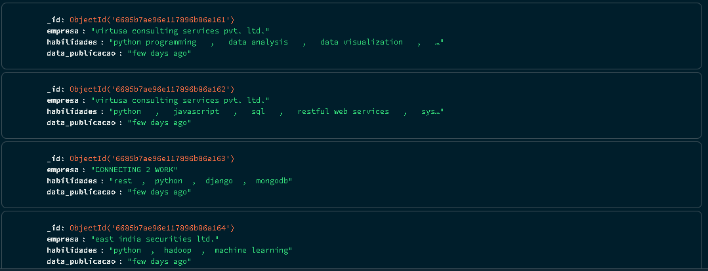

# Scaper de vagas em python 🤖 🌐

O projeto desenvolvido em Python é uma automação que irá coletar por meio de web scraping vagas de emprego para desenvolvedores Python no site TimesJobs e após a coleta das informações, irá armazenar essas informações em um banco de dados MongoDB.

O projeto visa simplificar e otimizar o processo de busca por vagas de emprego específicas e armazenar essas informações para futura análise e consulta. Além disso, traz os seguintes benefícios:

- **Centralização de Dados**: Todas as vagas de emprego coletadas são armazenadas em um banco de dados.

- **Automação do Processos**: Elimina a necessidade de busca manual por vagas de emprego, o que pode economizar tempo.

- **Acesso Rápido e Fácil**: Dados consolidados podem ser acessados rapidamente.

## Tecnologias utilizadas 📍

- **BeautifulSoup**: Biblioteca usada para o web scraping e para extração de dados de arquivos HTML e XML.

- **Requests**: Módulo utilizado para fazer requisições HTTP.

- **PyMongo**: Biblioteca responsável para interação com o MongoDB.

- **MongoDB**: Banco de dados não relacional utilizado para armazenar os dados coletados.

## Como configurar e utilizar o projeto🔧

Para utilizar o projeto, siga os seguintes passos:

1. Clone o repositório para sua máquina local:

```bash
git clone https://github.com/seu-usuario/Coletor_Vagas_Emprego.git
cd Coletor_Vagas_Emprego`
```

2. Dentro de um editor de código, instale as dependências do projeto:

```bash
pip install -r requirements.txt
```

3. Insira a URI de conexão do MongoDB no arquivo '**mongo_connection.py**':

```python
MONGO_URI = "sua_uri_do_mongodb"
```

4. Execute ao final das etapas o arquivo main.py:

```python
python main.py
```

Obs: Certifique-se de que seu MongoDB esteja em execução e acessível.

## Resultado final



